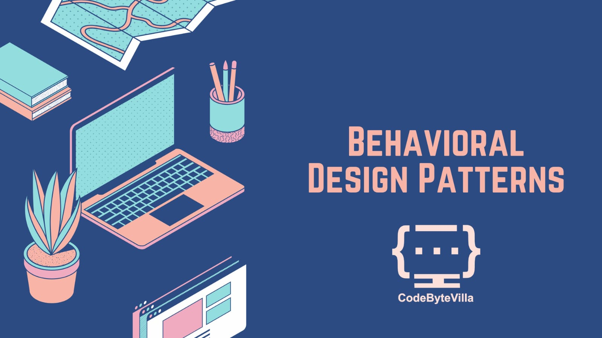

# iOS Behavioral Design Patterns

This repository provides an overview and implementation examples of various behavioral design patterns commonly used in iOS Swift development. Each pattern addresses specific challenges related to object collaboration and communication.

## Observer Pattern

### Overview:
The Observer pattern defines a one-to-many dependency between objects, allowing multiple objects to listen and react to changes in the state of a subject.

### When to Use:
- Implementing event handling mechanisms.
- Decoupling components in a system.

### Example:
Check out the [Observer Pattern Example](./01-Observer/README.md) for Swift implementation and usage scenarios.

## Strategy Pattern

### Overview:
The Strategy pattern defines a family of algorithms, encapsulates each algorithm, and makes them interchangeable. Strategy lets the algorithm vary independently from clients that use it.

### When to Use:
- Encapsulating algorithms to make them interchangeable.
- Allowing clients to choose from multiple algorithms dynamically.

### Example:
Explore the [Strategy Pattern Example](./02-Strategy/README.md) for Swift implementation and usage scenarios.

## Command Pattern

### Overview:
The Command pattern encapsulates a request as an object, allowing for parameterization of clients with different requests, queuing of requests, and logging of the parameters.

### When to Use:
- Implementing command queues.
- Supporting undo/redo functionality.

### Example:
Refer to the [Command Pattern Example](./03-Command/README.md) for Swift implementation and usage scenarios.

## Chain of Responsibility Pattern

### Overview:
The Chain of Responsibility pattern passes requests along a chain of handlers. Each handler decides either to process the request or to pass it to the next handler in the chain.

### When to Use:
- Achieving loose coupling between senders and receivers.
- Allowing multiple handlers to process a request.

### Example:
Check out the [Chain of Responsibility Pattern Example](./04-ChainOfResponsibility/README.md) for Swift implementation and usage scenarios.

## Interpreter Pattern

### Overview:
The Interpreter pattern provides a way to evaluate language grammar or expressions by defining a grammar for the language and an interpreter that interprets sentences in the language.

### When to Use:
- Building interpreters for domain-specific languages.
- Implementing language processing.

### Example:
Explore the [Interpreter Pattern Example](./05-Interpreter/README.md) for Swift implementation and usage scenarios.

## State Pattern

### Overview:
The State pattern allows an object to alter its behavior when its internal state changes. The object will appear to change its class.

### When to Use:
- Modeling state transitions in a system.
- Simplifying complex conditional statements.

### Example:
Refer to the [State Pattern Example](./06-State/README.md) for Swift implementation and usage scenarios.

## Memento Pattern

### Overview:
The Memento pattern captures and externalizes an object's internal state so that the object can be restored to this state later.

### When to Use:
- Implementing undo mechanisms.
- Storing and restoring object states.

### Example:
Check out the [Memento Pattern Example](./07-Memento/README.md) for Swift implementation and usage scenarios.

## Visitor Pattern

### Overview:
The Visitor pattern represents an operation to be performed on the elements of an object structure. It lets you define a new operation without changing the classes of the elements on which it operates.

### When to Use:
- Adding new operations to existing classes without modifying them.
- Processing elements of a complex structure.

### Example:
Explore the [Visitor Pattern Example](./08-Visitor/README.md) for Swift implementation and usage scenarios.

## Template Method Pattern

### Overview:
The Template Method pattern defines the skeleton of an algorithm in the superclass but lets subclasses alter specific steps of the algorithm without changing its structure.

### When to Use:
- Providing a template for an algorithm while allowing variations in specific steps.
- Ensuring the reusability of common algorithm steps.

### Example:
Refer to the [Template Method Pattern Example](./09-TemplateMethod/README.md) for Swift implementation and usage scenarios.

## Iterator Pattern

### Overview:
The Iterator pattern provides a way to access elements of an aggregate object sequentially without exposing its underlying representation.

### When to Use:
- Simplifying the traversal of collections.
- Decoupling the client code from the internal structure of a collection.

### Example:
Check out the [Iterator Pattern Example](./10-Iterator/README.md) for Swift implementation and usage scenarios.

Feel free to explore each pattern's folder for detailed explanations, Swift implementations, and example usage scenarios.
